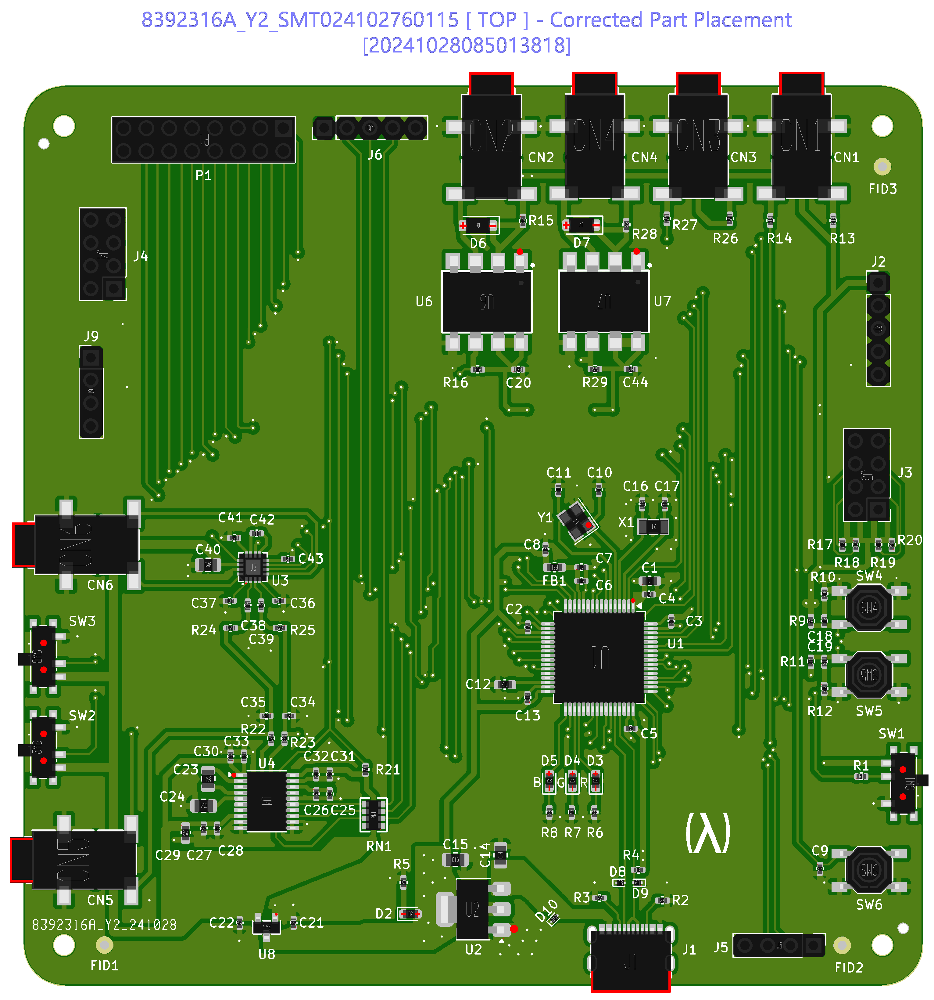
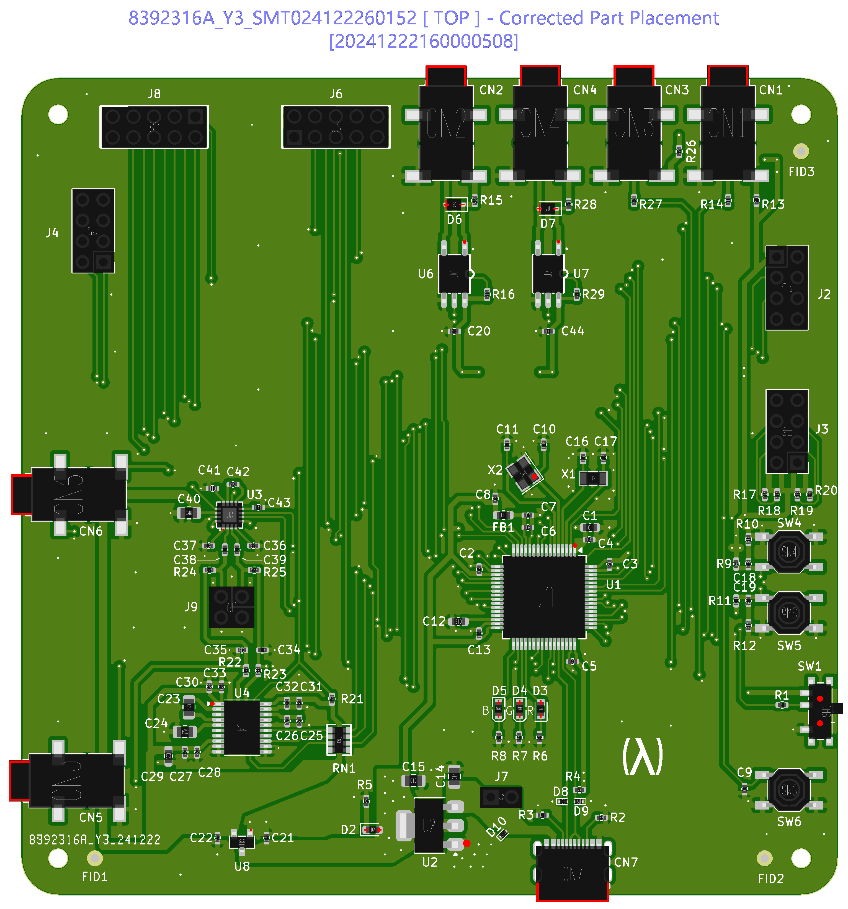

# MIDI Synthesizer Proof of Concept 1

**Feedback is very welcome!**

* Author: [Douglas P. Fields, Jr.](mailto:symbolics@lisp.engineer)
* My portions Copyright 2024 Douglas P. Fields, Jr.
* My portions License: Creative Commons Attribution-ShareAlike 4.0
  * AKA `CC BY-SA 4.0`
  * [See LICENSE.md](LICENSE.md) or [CC site](https://creativecommons.org/licenses/by-sa/4.0/deed.en)
* Started 2024-09-28
* Last updated 2025-04-20
* [Repo Self-Link](https://github.com/LispEngineer/stm-midi-poc1)

Overviews:
* 3D Views
  * 
  * 
* [Schematic PDF](stm-midi-poc1.pdf)
* [Board Plots as PDF](plots/stm-midi-poc1__Assembly.pdf)
  * From Board2PDF KiCAD Plugin
* [Interactive BOM](bom/ibom.html)
  * From Interactive BOM KiCAD Plugin

Design documents:
* [Design notes](Design.md)
* Designed in [KiCAD 8](https://www.kicad.org/)
* LCSC part numbers included for assembly by [JLCPCB](https://jlcpcb.com/)

Debuggers:
* Segger J-Link EDU Mini
* Segger J-Link Plus v10.1 (second hand)
  * Built in VCOM port - only seems to work at 115,200 baud
* ST-Link v3
* FTDI USB to TTL UART

Software:
* [Pinout](https://github.com/LispEngineer/stm-midi-poc1-sw)
* [STM Synth](https://github.com/LispEngineer/nucleo-uart)
* [My KiCAD Libraries](https://github.com/LispEngineer/KiCAD_Libraries)

Discussions:
* [Smaller Optoisolator](https://www.reddit.com/r/synthdiy/comments/1gghujj/smaller_midi_optoisolator/)

## Key Reference Documents

* [DS11853](TODO) - Datasheet: Arm® Cortex®-M7 32b MCU+FPU, 462DMIPS, up to 512KB Flash
  256+16+4KB RAM, USB OTG HS/FS, 18 TIMs, 3 ADCs, 21 com IF
* [RM0431](TODO) - STM32F72xxx ... advanced Arm®-based 32-bit MCUs
* [PM0253](TODO) - STM32F7 Series ... Cortex®-M7 processor programming manual
* [ES0360](TODO) - STM32F72xxx ... device limitations
* [AN2867](TODO) - Guidelines for oscillator design on ... STM32 MCUs/MPUs
* [AN4661](TODO) - Getting started with STM32F7 Series MCU hardware development
* [AN5612](TODO) - ESD protection of STM32 MCUs
* [AN4879](TODO) - Introduction to USB hardware and PCB guidelines using STM32 MCUs
* [AN4989](TODO) - STM32 microcontroller debug toolbox
* [AN4676](TODO) - STM32F7 Series peripheral interconnections
* [AN4031](TODO) - Using the STM32F2, STM32F4 and STM32F7 Series DMA controller

Moving to STM32H7:
* [AN5293](TODO) - Migration guide from STM32F7 Series to STMH74x/75x, STM32H72x/73x and STMH7A3/7Bx devices
* [AN4936](TODO) - Migration of microcontroller applications from STM32F7 Series to STM32H743/753 line

# Production Runs

I have been using JLCPCB.

* [JLCPCB instructions](https://jlcpcb.com/help/article/how-to-generate-gerber-and-drill-files-in-kicad-8)
  on creating Gerber and Drill files for KiCAD 8.
* You can also use the
  [JLCPCB KiCAD plugin](https://github.com/Bouni/kicad-jlcpcb-tools).
  * Installed using the *Plugin and Content Manager* in KiCAD.
  * This usefully shows you the stock count for your parts, and whether
    they are Basic or Extended.
  * Current version (2024-12-21) gives a lot of errors about redundant
    parts already in the catalog though (annoying).
* Or maybe I was using [this JLCPCB KiCAD plugin](https://github.com/bennymeg/Fabrication-Toolkit).

## Run 1 - EVT#1

* Submitted: 2024-10-27
* Git Commit: `6f9e281abe9c22ef3b995376c3df42217fc04524`
* Producer: JLCPCB
  * Order #W202410271206812 
* Boards: 5
* Assemblies: 2
* [BOM](jlcpcb/production_files/BOM-stm-midi-poc1.csv)
* [CPL](jlcpcb/production_files/CPL-stm-midi-poc1.csv)
* [Gerbers](jlcpcb/production_files/GERBER-stm-midi-poc1.zip)
* JLCPCB Corrected Part Placement
  
* [JLCPCB Submission](jlcpcb-production/run1-20241027/stm-midi-poc1 6f9e281abe9c22ef3b995376c3df42217fc04524_Y2.zip)
* Status: Production complete; in DHL's hands for delivery Nov 8
* Cost:
  * PCB: $28.02
  * Assembly: $79.66
  * Shipping: $32.60 (DHL)
  * Sales tax: $11.22
  * Total: $151.50

I received two fully populated boards. One was missing the J5 header.

## Run 2 - EVT#2

* Submitted: 2024-12-21 (11PM NYC time)
  * PCB and PCBA confirmed: 2024-12-22
* Git Commit: `e48a22093a1c81bb14c9082240e3d44837e7d75e`
* Producer: JLCPCB
* Order #W202412221204947 
* Boards: 5
* Assemblies: 2
* [BOM](jlcpcb/production_files/BOM-stm-midi-poc1.csv)
* [CPL](jlcpcb/production_files/CPL-stm-midi-poc1.csv)
* [Gerbers](jlcpcb/production_files/GERBER-stm-midi-poc1.zip)
* JLCPCB Corrected Part Placement
  
* [JLCPCB Submission](jlcpcb-production/run2-20241221/GERBER-stm-midi-poc1_Y3.zip)
* Status: Confirmed for PCB/PCBA
* Cost:
  * PCB: $8.00
  * Assembly: $86.40
  * Shipping: $58.36 (FedEx - "remote area" charge)
  * Sales tax: $12.22
  * Total: $164.98
* Received: 2025-01-03 (delivered on 2025-01-02)

Results:
* They did not add assembly holes this time (interesting, maybe re-used the mounting holes)
* STM32 Debugger (ST-Link v3) does not seem to reliably connect anymore.
  * It did allow me to download the firmware but is not reliable.
  * Sometimes it says "Failed to enable Live Expressions"
* SPI display works
* Audio Gain pins work
* Audio mute works
* Headphone output works
* Buttons & LEDs work

TODO:
* Test MIDI in/out
* Test Line out
* Test various resistors for the headphone
* Test I2C
* Test GPIO

# Miscellaneous Notes

* Footprints, models, etc., by their respective authors
* Some footprints, schematics, models are from these sources:
  * [Component Search Engine](https://componentsearchengine.com)
  * [Snap EDA](https://snapeda.com)
  * [EasyEDA](https://easyeda.com)
* Useful tools:
  * [EasyEDA2KiCAD](https://github.com/uPesy/easyeda2kicad.py)
  * [JLC Parts Finder](https://yaqwsx.github.io/jlcparts/)
  * [Altium Viewer](https://www.altium365.com/viewer/)
    * If you have Altium files and want to get details out of them
      but only use KiCAD

# KiCAD Configuration Notes

Using EasyEDA2KiCAD:

* Create a Path Substitution
  * Use main KiCAD window: Prefernces -> Configure Paths...
  * `EASYEDA2KICAD`
  * [Git Repository](https://github.com/LispEngineer/KiCAD_Libraries)
* Create a Footprint Library
  * `easyeda2kicad` Nickname
  * `${EASYEDA2KICAD}/easyeda2kicad.pretty`
* Create a Symbol Library
  * `easyeda2kicad` Nickname
  * `${EASYEDA2KICAD}/easyeda2kicad.kicad_sym` Library Path

# Status

* Schematic: Done
* LCSC part IDs: Almost Done
  * Need non-Red LEDs
* Schematic symbols: Done
* Footprints: Done
* 3D models: Done
* PCB Layout: Done
* Production 1 run: Done - in shipping

## TODOs

* Use STDC14 connector for ST-Link v3
  * Digikey [1175-1632-ND](https://www.digikey.com/en/products/detail/cnc-tech/3220-14-0300-00/3883270?s=N4IgTCBcDaIIxwOwFYC0cBsBmMqByAIgAQgC6AvkA)
    * Not in JLCPCB
  * Mouser [SHF-107-01-L-D-SM](https://www.mouser.com/ProductDetail/Samtec/SHF-107-01-L-D-SM?qs=%252BZP6%2F%252BtExtBY5XT826bN4g%3D%3D)
    * [Footprint](https://kinetictest.samtec.com/partnumber/shf-107-01-l-d-sm#featureinformation)
    * [JLCPCB C17640678](https://jlcpcb.com/partdetail/Samtec-SHF_107_01_L_DSM/C17640678) - $2???
    * [LCSC Alternative 1](https://www.lcsc.com/product-detail/Pin-Headers_Hanbo-Electronic-Hanbo-Electronic-HB-PH9-12727PB2GOB_C6332251.html) C6332251
    * [LCSC Alternative 2](https://www.lcsc.com/product-detail/Pin-Headers_HCTL-HCTL-PZ127-2-07-S_C3975190.html) C3975190 - 11¢
    * [LCSC Alternative 3](https://www.lcsc.com/product-detail/Pin-Headers_XKB-Connection-XKB-Connection-X1321WVS-2x07J-C40D53_C2881912.html) C2881912
* Use a 4-pin 32kHz clock?
* RN1 footprint and 3D model look a little bit off - footprint is a bit too small?
* Test points/pins
* MCU Pin 24 is not used - it is I2S1_MCK
* Incorporate my own ST-Link?
  * [See Hackaday](https://hackaday.io/project/179054-custom-st-link-v20-v21-v30)

### DONE

* DONE(EVT2): Find a much smaller Opto-isolator for MIDI than the one chosen here
  * [TLP2362](https://toshiba.semicon-storage.com/us/semiconductor/product/isolators-solid-state-relays/detail.TLP2362.html)
    is used by [Ksoloti 0.6](https://ksoloti.github.io/5-resources.html). Tested to work with
    1.8kΩ pull-up resistor instead of the schematic's 2.7kΩ.
    (Also worked with no pull-up resistor!)

# Board Layout Notes

4-layer design with Signal/GND/GND/Signal for EVT board.

Will do most important routing first on the top copper layer:
* Decoupling/bypass capacitors
* Clock signals
* High speed signals
  * USB
  * DAC
  * SWD

Remaining signals will be routed using "Manhattan routing."
That is, one signal layer will run up/down, the other will
run left/right, mostly.
* Top layer: up/down
* Bottom layer: left/right

After that, do these routings:
* Audio signals
* MIDI signals
* SPI
* I²C
* UI (Buttons, LEDs)
* GPIO
* Power

Fill in some positive power areas with fill.

Finally, the signal layers will be filled with GND at the end,
and the ground planes should be stitched together with lots
of vias.

## After Layout Is Done

* DRC check
* Cleanup Tracks & Vias

# BOM Notes

* Docs say you need a 4.7 uF ceramic capacitor with low ESR DS11853 Rev 9 page 105
  * Samsung CL10A475KO8NNNC works *but* Datasheet doesn't say what the ESR is, just "low ESR"
  * [Notes on the Cap](https://community.st.com/t5/stm32-mcus-products/how-supply-stm32f446ret6/td-p/635424)

* [ISOM8710](https://www.ti.com/product/ISOM8710) 
  is a drop-in replacement for the
  [TLP2362](https://toshiba.semicon-storage.com/us/semiconductor/product/isolators-solid-state-relays/detail.TLP2362.html)
  * Same form factor
  * Same functionality (tested on a breadboard)
  * Same circuit
  * Does not seem to be carried at JLCPCB

# Notes for future

* Use fewer header types, they're all extended parts
* Don't use the Resistor Network - due to the Extended parts fee from JLC
  * OTOH there are no 56Ω resistors in the Basic parts library
  * C25127 is an extended part 0402
  * C17714 is an 0805 47Ω
* Add I/O activity LEDs for MIDI & serial?
* Add a pin for VBUS (5V from USB) and USB GND
* Add pins for the TRS jacks
* Get a 4-way switch for gain?
* Rewrire the headphone amp like Pimoroni?
* Move console from UART3 to UART2
  * Move console pins next to SWD pins for easy use with STLink
* Install UART to USB bridge
  * [FTDI FT234XD](https://ftdichip.com/products/ft234xd/) is a nice 12-pin package
  * [Example Circuit](https://github.com/z4yx/USB-C-Serial)
  * [JLCPCB Part](https://jlcpcb.com/partdetail/Ftdi-FT234XDR/C132158)

Longer term
* Move to an STM32H7 device
* Move to a [higher pin-count device](https://www.st.com/en/microcontrollers-microprocessors/stm32h7-series/products.html)
  * LQFP 64, 100, 144, 176, 208
    * low-profile quad flat package - LQFP 64 currently in use
  * TFBGA 216, 225, 240+25
    * Thin Profile Fine Pitch Ball Grid Array
    * thinner than other BGA packages - Gemini
  * UFBGA 144, 169, 176+25
    * ultra fine pitch ball grid array
  * VFQFPN 68
    * thermally enhanced very thin profile fine pitch quad flat package no lead (Gemini)
  * WLCSP 132, 156
    * [Wafer-Level Chip Scale Packaging](https://www.flashpcb.com/blog/QFP-QFN-BGA-WLSCP)
* Add an SDRAM

# EasyEDA 2 KiCAD Notes

`python -m easyeda2kicad --full --lcsc_id=Cxxxxx`

[My imported library is in GitHub](https://github.com/LispEngineer/KiCAD_Libraries).